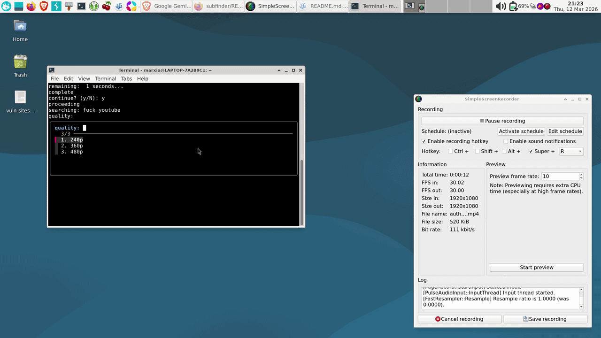

# unrot-yt  

`unrot-yt` is a command line tool that allows you to watch videos through the  
command line interface, it prevents scrolling through youtube recommended page.  

## Features  

<h1 align="left">
  </a>
  <br>
</h1>

- blocks you for 5 minutes before watching.  
- only goes up to 480 (less stimulation)  
- default option encourages more friction.  

## Installation
```
https://github.com/gelgelgelo/unrot-yt

sudo mv unrot-yt /usr/local/bin/

unrot-yt
```

## Usage  
```  
unrot-yt "<search/vid title>"  

or   

unrot-yt  
```  

